# iSCSI Boot Configuration Guide for iDRAC9

This guide outlines the process for correctly configuring iSCSI Boot using **iDRAC9** (found in 14th through 17th generation Dell PowerEdge servers). Due to UI similarities, these steps may also apply to **iDRAC8** (13th generation).

> [!NOTE]
> The screenshots in this guide utilize **Synology DSM** with **SAN Manager**.

---

## Step 1: Creating the LUN

The **LUN (Logical Unit Number)** is essentially the Virtual Disk that will be presented to your Host.

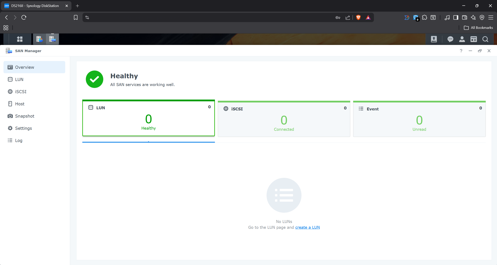

1. Open **SAN Manager** and initiate the LUN creation wizard.

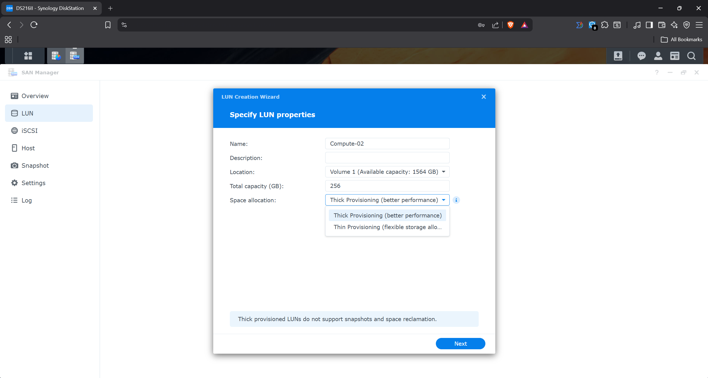

2. In the wizard, set the access permissions to **Custom**. This ensures that only hosts with the correct **IQN (iSCSI Qualified Name)** can access the LUN.

### Understanding the IQN
The IQN is the unique identifier the host uses to introduce itself during the connection handshake. The connection will only succeed if the host's IQN matches the permitted IQN in your LUN configuration.

An IQN follows a specific naming convention:
`type.date-code.naming-authority:unique-name`

**Example:**
`iqn.2026-03.local.promot:node.compute-2`

* **Type:** Usually `iqn`.
* **Date-Code:** The year and month the naming authority was established.
* **Naming-Authority:** Typically the reverse DNS of your organization.

> [!IMPORTANT]
> Ensure you select the **Thin Provisioning** or **Space Reclamation** settings that correspond to your intended OS. In this example, we are using **Proxmox (Linux)**.

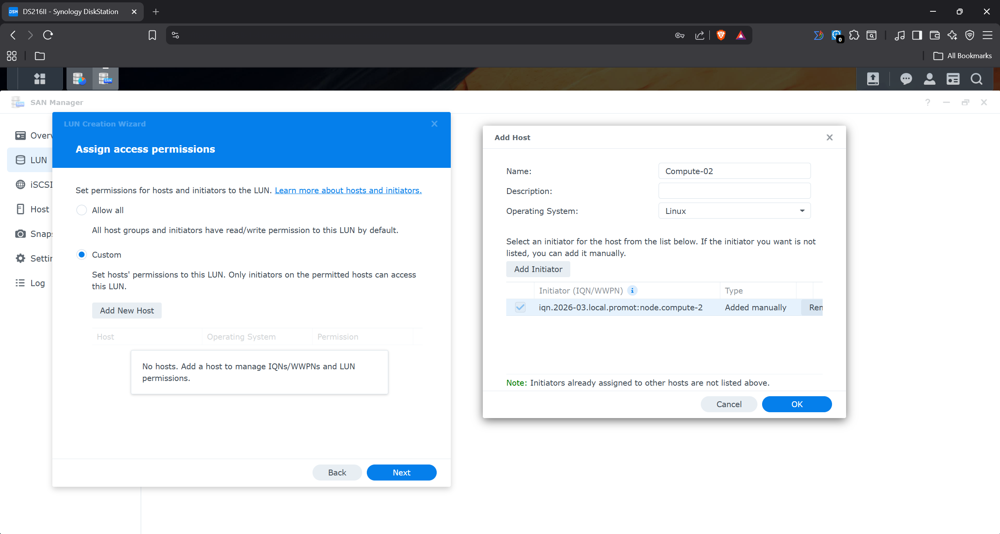

3. Assign the host permissions to the LUN you just created.

4. Review the iSCSI details. You will see the **Target IQN**. You can click **Edit** to simplify the default IQN into something more human-readable.

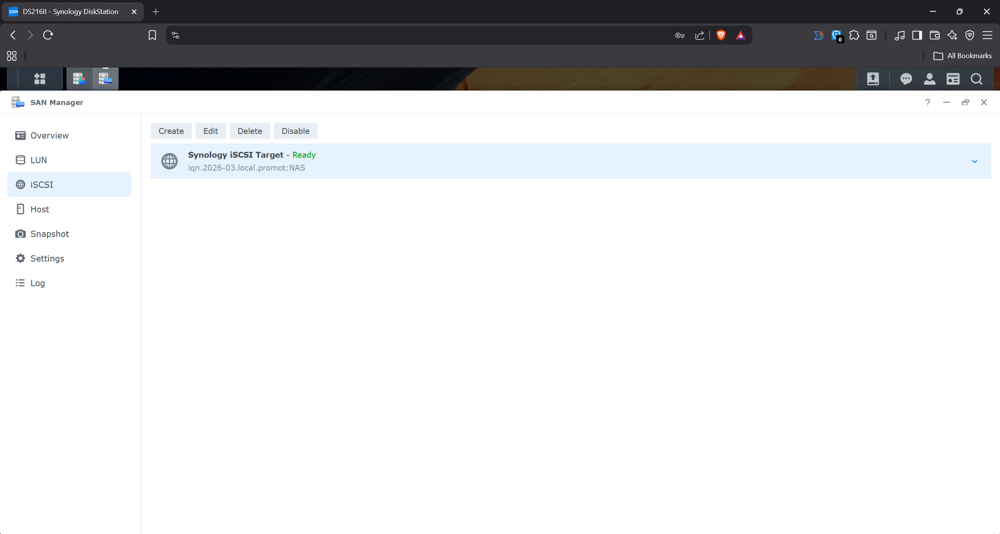

## Step 2: Installing the OS on the LUN

For this step, you'll need a temporary machine where you can connect the LUN and install the OS. This machine doesn't need to be the final boot host—just one with matching BIOS/UEFI settings and an OS installation image.

### Installing Proxmox

1. Select **Advanced Options** and then **Install with Graphical Debug Mode**.

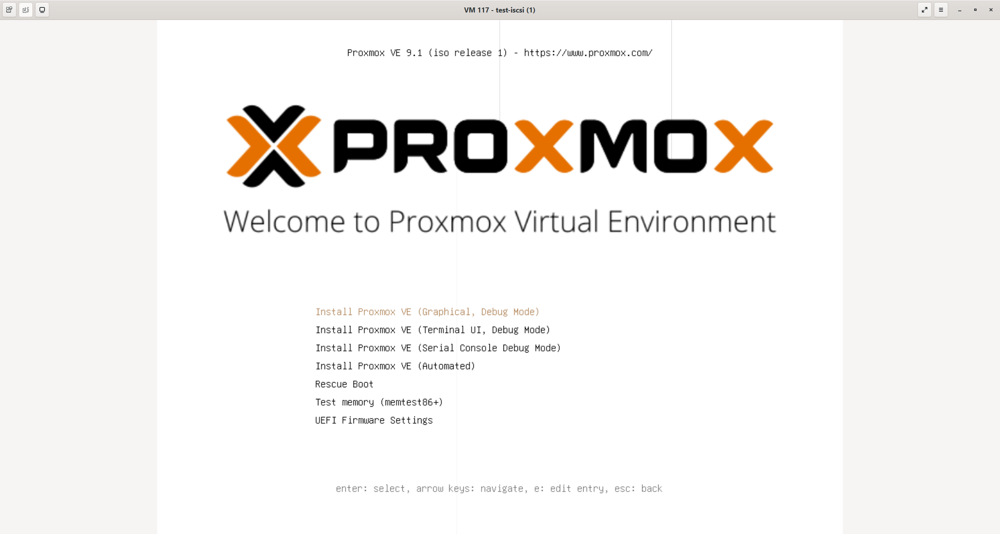

2. Press **Ctrl+D** to exit Debug mode and enter the Bash shell.

3. Set up IPv4 networking for the temporary machine. First, identify your network adapter name, then configure it:

```bash
ip addr add 192.168.1.97/24 dev ens18
ip link set ens18 up
ip a
ping 192.168.1.4
```

You don't need to configure a Gateway. Verify that your machine can reach the target IP address.

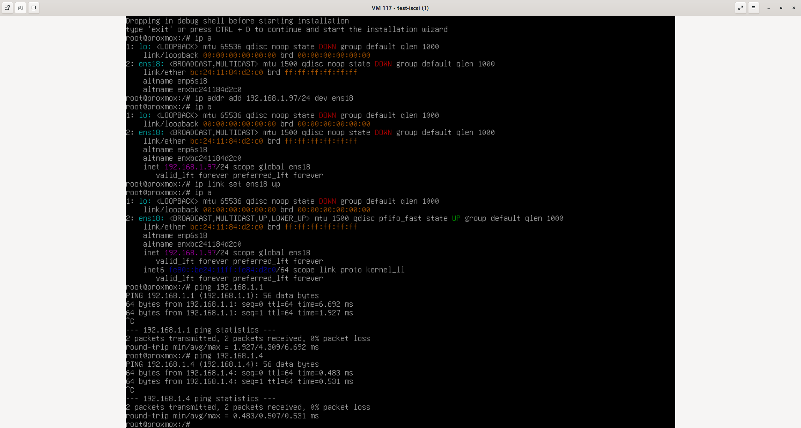

4. Install the required iSCSI libraries. These packages are available on the Proxmox installation media:

```bash
cd /cdrom/debian/proxmox/packages

dpkg -i libisns*.deb
dpkg -i libopeniscsiusr*.deb
dpkg -i open-iscsi*.deb
```

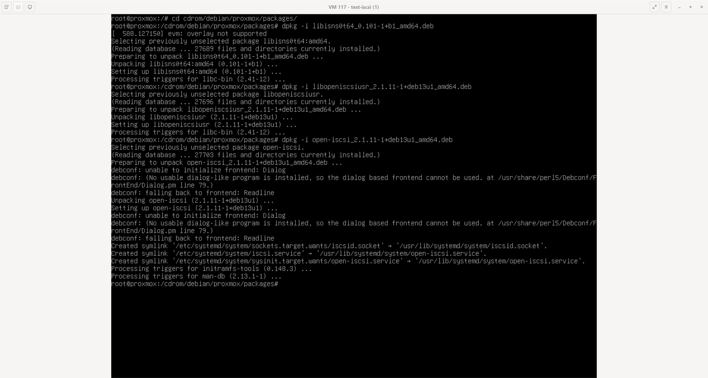

5. Connect to the iSCSI LUN:

```bash
iscsistart -t <Target-IQN> -i <Initiator-IQN> -g N -a <Target-IP>

lsblk
```

Verify that a new disk appears in `lsblk` with the correct size.

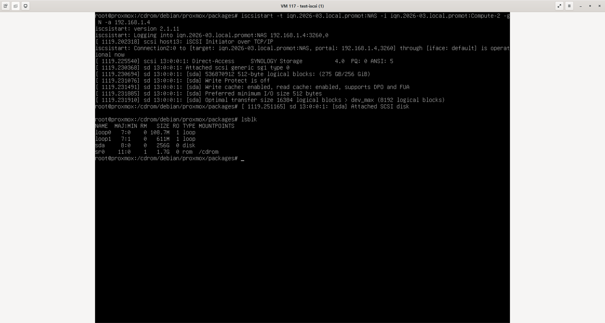

6. Press **Ctrl+D** to return to the graphical Proxmox installer. Select the new disk for installation.

> [!WARNING]
> Do not reboot the system after the installation finishes. Additional configuration is required.

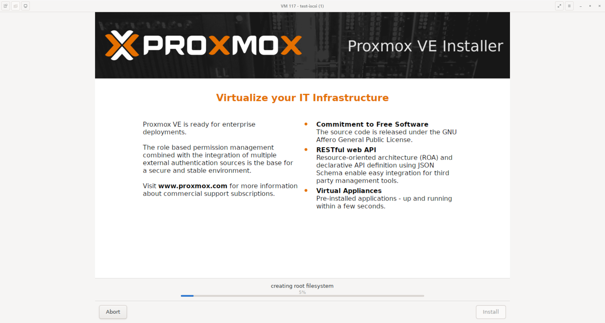

## Step 3: Preparing the OS for iSCSI Boot

1. Mount the LVM partition of the installed Proxmox system:

```bash
mount /dev/pve/root /mnt
```

2. Bind system directories to allow access from the current shell:

```bash
mount -o bind /dev /mnt/dev
mount -o bind /proc /mnt/proc
mount -o bind /sys /mnt/sys

chroot /mnt /bin/bash
```

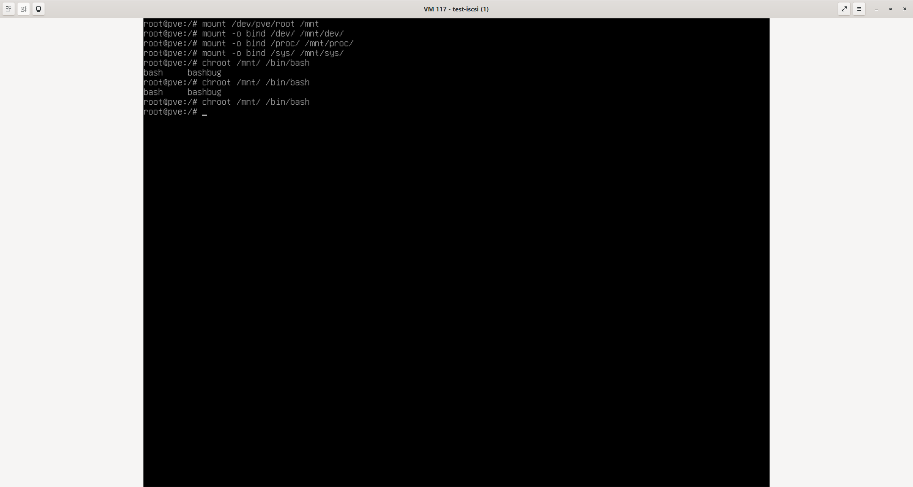

3. Configure the iSCSI initial ramdisk to enable automatic iSCSI connection at boot. Edit the configuration file:

```bash
nano /etc/iscsi/iscsi.initramfs
```

Set the following parameter:

```
ISCSI_AUTO=true
ISCSI_IBFT=true
```

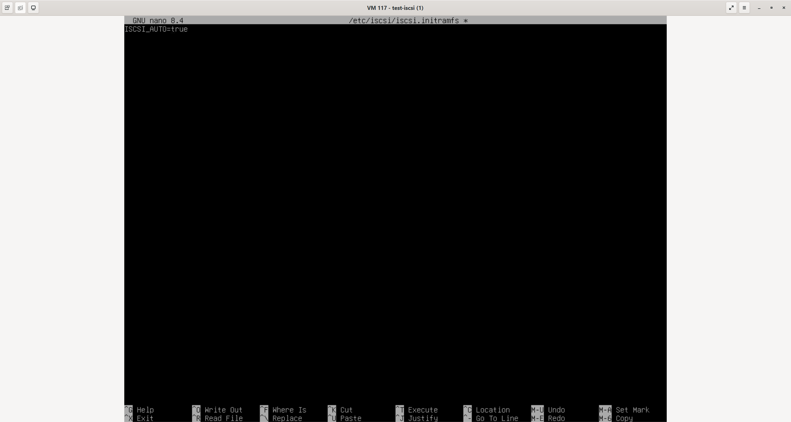

Activate the neccesary modules:

```bash
nano /etc/initramfs-tools/modules
```

Set the following parameter:

```
iscsi_ibft
iscsi_tcp
```

Then set the boot to iscsi:

```bash
nano /etc/initramfs-tools/initramfs.conf
```

Set the following parameter:

```
BOOT=iscsi
```

And set the initiator name:


```bash
nano /etc/iscsi/initiatorname.iscsi
```

Set the following parameter:

```
"InitiatorName=iqn.2026-03.rest-of-initiator-name..."
```

4. Update GRUB and the initial ramdisk:

```bash
update-grub
update-initramfs -u -k all
```

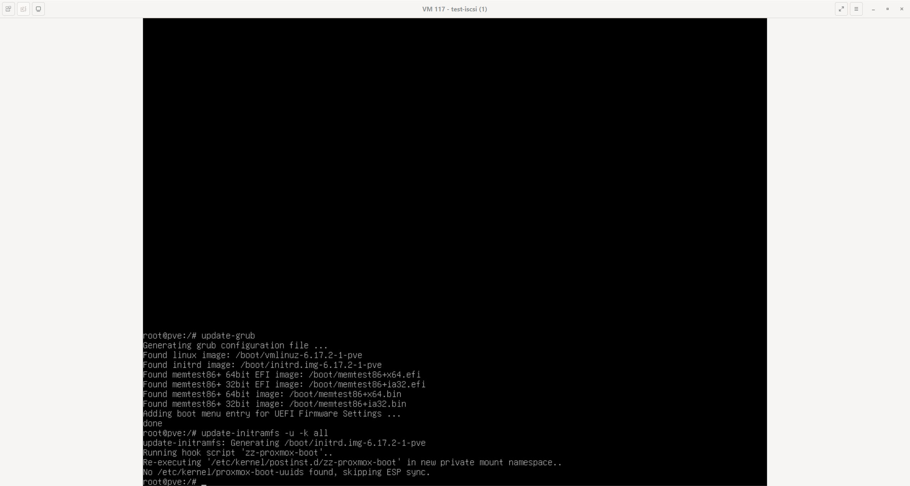

5. Exit the chroot environment by pressing **Ctrl+D** twice:
   - First to exit the LUN's root session
   - Second to exit the installation media's root session

## Step 4: Configuring iSCSI Boot on iDRAC

At this point, you've completed the LUN setup, installed the OS, and configured it for iSCSI boot. This final step involves BIOS configuration and is the most complex due to numerous settings.

### Accessing BIOS

1. Boot into the server's BIOS by pressing **F2** during startup.

   Alternatively, you can configure these settings via:
   - Lifecycle Controller
   - iDRAC interface (Configuration > BIOS Settings)

   For simplicity, we'll use the BIOS directly.

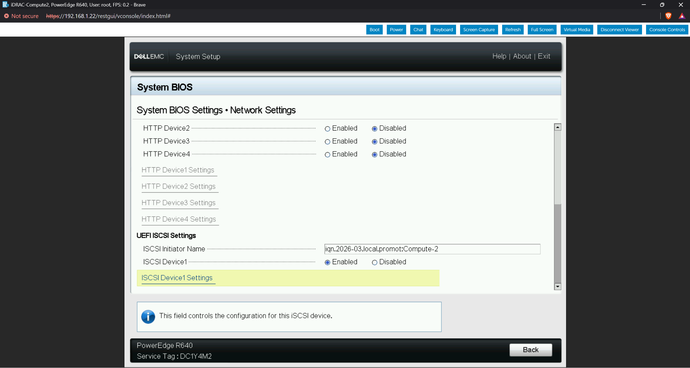

### Configuring Network Settings

2. Navigate to **System BIOS > Network Settings** and configure the following two entries:

```
ISCSI Initiator Name: <Initiator-IQN>
ISCSI Device1: Enabled
```

### Configuring iSCSI Device1

3. Enter **ISCSI Device1 Settings** and ensure **Connection 1** is enabled.

4. Enter **Connection 1 Settings** and configure the following parameters:

| Parameter | Value |
|-----------|-------|
| **Interface** | An interface with access to the Target network |
| **Protocol** | According to your installation requirements |
| **DHCP** | Enabled or Disabled (if disabled, manually set IP and netmask on the following lines) |
| **Target info via DHCP** | Disabled |
| **Target Name** | `<Target-IQN>` |
| **Target IP Address** | `<Target-IP>` |
| **Target Port** | `3260` (default iSCSI port) |
| **Target Boot LUN** | `1` (adjust if your target has multiple LUNs) |

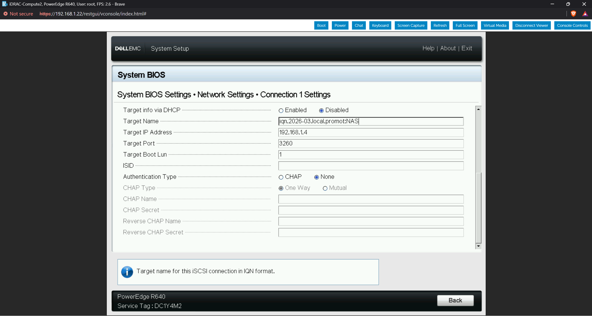

### Saving Configuration

5. Exit BIOS after all settings are configured.

> [!IMPORTANT]
> Remember to save your changes before exiting BIOS!

